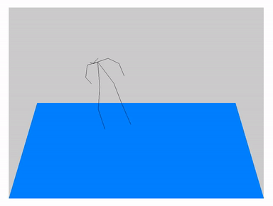

# dance-view

More details to come.



From: [Evolution Of Dance](https://www.youtube.com/watch?v=dMH0bHeiRNg).

### Usage

```
stack run -- -- --width 384 --height 288 --fps 14.99 --source-directory ../data/evolution_output
```

Supposing you've run OpenPose and have such an output directory.


### Misc

#### Using `ffmpeg` to make high quality gifs

```
ffmpeg -y -i input.mkv -vf fps=10,scale=320:-1:flags=lanczos,palettegen palette.png
ffmpeg -i input.mkv -i palette.png -filter_complex  "fps=10,scale=320:-1:flags=lanczos[x];[x][1:v]paletteuse" output.gif
```
